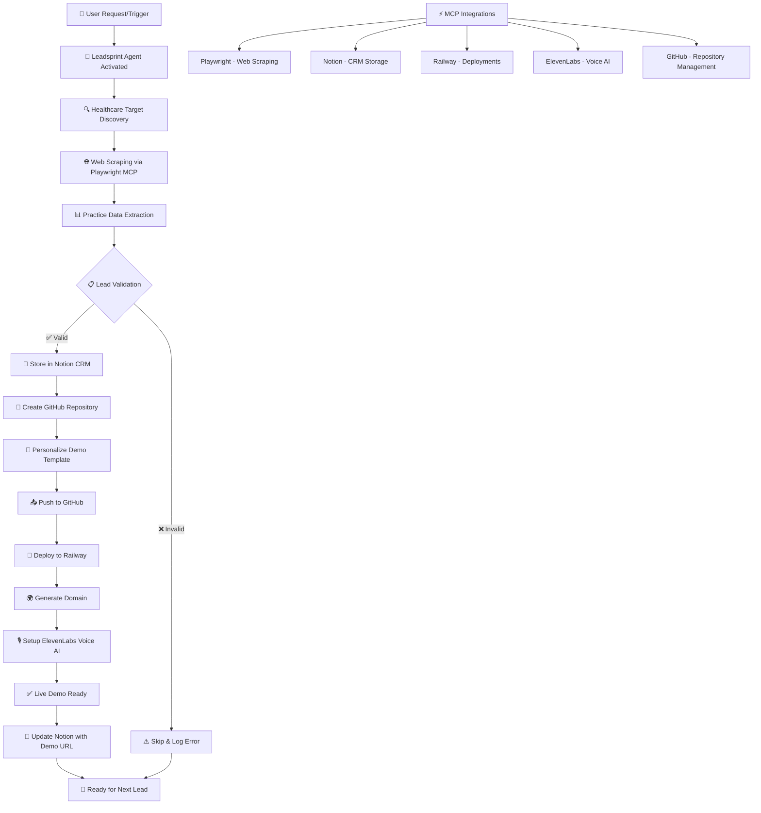

# Leadsprint AI 🚀

**Automated Healthcare Lead Generation and Demo Deployment Platform**

Leadsprint AI is a powerful automation platform that combines AI-powered lead generation with autonomous deployment capabilities. Our platform automatically researches healthcare practices, creates personalized demo sites, and deploys them across multiple platforms.

## 🎯 Core Concept

**One Lead = One Repository = One Railway Service**

Each discovered healthcare practice gets:
- ✅ Dedicated GitHub repository
- ✅ Personalized Next.js demo site  
- ✅ Automated Railway deployment
- ✅ Custom domain configuration
- ✅ AI voice assistant integration

## 🏗️ Architecture

```
Leadsprint AI Platform
├── 🤖 Autonomous Agent (Docker)     # Lead discovery & automation
├── 🌐 Frontend Platform (Next.js)   # Multi-tenant demo sites
├── 🚂 Railway Integration           # Automated deployments
├── 📊 Notion CRM                    # Lead management
└── 🎙️ ElevenLabs Integration       # Voice AI assistants
```

## 🔄 Automation Workflow



**Workflow Steps:**
1. **🎯 Trigger**: Agent activation via API or scheduled task
2. **🔍 Discovery**: Target healthcare practice websites 
3. **🌐 Scraping**: Extract practice data using Playwright MCP
4. **📋 Validation**: Verify data completeness and accuracy
5. **💾 Storage**: Save lead to Notion CRM database
6. **📁 Repository**: Create dedicated GitHub repo per practice
7. **🎨 Personalization**: Customize Next.js demo with scraped data
8. **🚂 Deployment**: Automated Railway service deployment
9. **🌍 Domain**: Generate custom demo URL
10. **🎙️ Voice AI**: Configure ElevenLabs assistant
11. **✅ Ready**: Live personalized demo accessible
12. **📧 Update**: CRM updated with demo URL and status

## ⚡ Quick Start

### Prerequisites
- Node.js 18+
- Docker (for autonomous agent)
- Railway account
- GitHub account with API token

### Environment Variables
```bash
# Core Tokens (Required)
GITHUB_TOKEN=your_github_token
RAILWAY_TOKEN=your_railway_token  
NOTION_DATABASE_ID=your_notion_database_id
ELEVENLABS_API_KEY=your_elevenlabs_key

# Agent Configuration
SMITHERY_API_KEY=your_smithery_key
SMITHERY_PROFILE=your_profile
```

### 1. Start Frontend Platform
```bash
npm install
npm run dev
```

### 2. Run Autonomous Agent
```bash
cd leadsprint-agent
npm install
node autonomous-agent-typescript-mcp.js
```

### 3. Deploy via Railway
```bash
npm run railway:deploy
```

## 🎛️ Available Scripts

| Script | Description |
|--------|-------------|
| `npm run dev` | Start development server |
| `npm run build` | Build for production |
| `npm run railway:deploy` | Deploy to Railway |
| `npm run deploy:single` | Deploy single practice |
| `npm run deploy:all` | Mass deployment |

## 🤖 Autonomous Agent

The Leadsprint Agent (`/leadsprint-agent/`) handles:
- **Lead Discovery**: Web scraping healthcare practice websites
- **Repository Creation**: Automated GitHub repo generation
- **Demo Deployment**: Railway service provisioning
- **Domain Management**: Custom domain configuration
- **CRM Integration**: Notion database updates

### Agent API Endpoints
- `GET /health` - Health check
- `POST /webhook/railway` - Railway deployment webhook
- `GET /leads` - List discovered leads
- `POST /deploy` - Trigger deployment

## 🌟 Features

- **🎯 Intelligent Lead Discovery**: Advanced web scraping with fallback mechanisms
- **🚀 Autonomous Deployment**: Zero-touch Railway deployments
- **🎨 Dynamic Branding**: Personalized sites per practice
- **🎙️ AI Voice Integration**: ElevenLabs voice assistants
- **📊 CRM Integration**: Automatic Notion updates
- **🌐 Multi-Platform**: Support for multiple deployment platforms
- **🔒 Security First**: Environment-based configuration
- **📈 Scalable**: Designed for hundreds of concurrent deployments

## 🚂 Railway Integration

Automated Railway deployments include:
- Service creation and configuration
- Environment variable management
- Domain provisioning
- Build and deployment monitoring
- Health check validation

## 📊 Notion CRM Integration

Automatic lead management with:
- Practice information storage
- Deployment status tracking
- Contact details management
- Performance analytics

## 🎙️ ElevenLabs Voice AI

AI voice assistants with:
- Practice-specific personalities
- Appointment booking capabilities
- Real-time conversation handling
- Multi-language support

## 🛠️ Development

### Local Development
```bash
# Install dependencies
npm install

# Start development server
npm run dev

# Run autonomous agent
cd leadsprint-agent
node autonomous-agent-typescript-mcp.js
```

### Docker Development
```bash
# Build agent container
cd leadsprint-agent
docker build -t leadsprint-agent .

# Run agent container
docker run -p 3001:3001 \
  -e GITHUB_TOKEN=$GITHUB_TOKEN \
  -e RAILWAY_TOKEN=$RAILWAY_TOKEN \
  leadsprint-agent
```

## 📝 License

MIT License - see LICENSE file for details

## 🤝 Contributing

1. Fork the repository
2. Create feature branch (`git checkout -b feature/amazing-feature`)
3. Commit changes (`git commit -m 'Add amazing feature'`)
4. Push to branch (`git push origin feature/amazing-feature`)
5. Open Pull Request

## 📞 Support

For support and questions:
- Create an issue on GitHub
- Check documentation in `/docs`
- Review agent logs for troubleshooting

---

**Built with ❤️ by the Leadsprint AI Team**